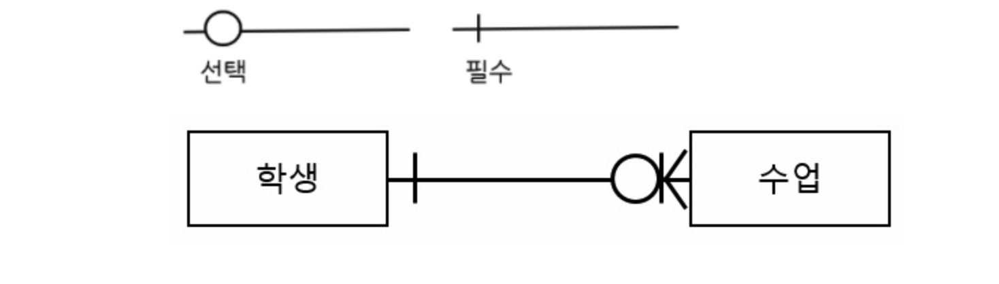
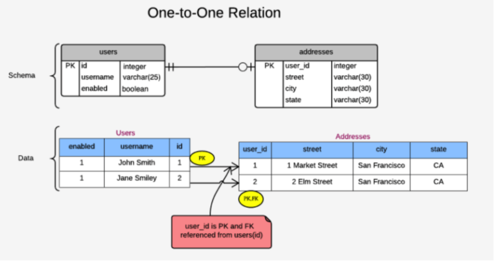
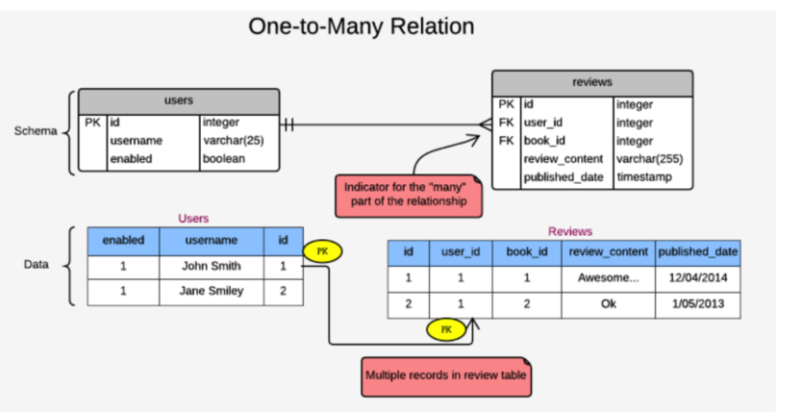
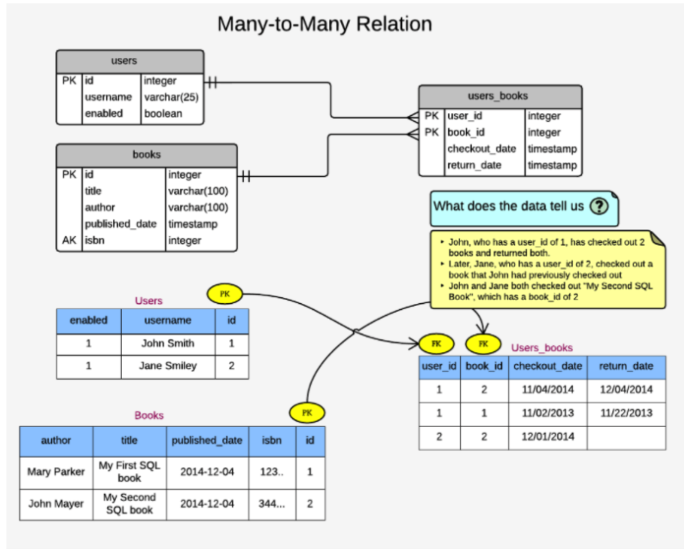

# 데이터베이스의 관계(Relationship) 기본 (1:1, 1:N, N:N)
### 관계
- 관계명 : 관계의 이름: 엔티티가 관계에 참여하는 형태를 지칭하는 이름으로, 두 개의 엔티티에 대한 것이기 때문에 하나의 관계는 2개의 현재형으로 표현한 관계명을 갖는다.
- 관계차수 : 두 개의 엔티티 관계에서 참여자수를 표현하는 것을 관계차수라고한다. 일반 적인 관계 차수 표현 방법으로는 1:1, 1:N, N:N이다. 관계 차수에서 가장 중요하게 고려해야할 사항은, 한쪽 엔티티와 관계를 맺은 다른 한쪽 엔티티 쪽이 하나의 객체만을 가지는지, 혹은 여러개의 객체를 가질 수 있는지 파악하는것이 중요하다.
- 관계 선택 사양(Optionality) - 관계에서 항상 참여해야하는지 (필수관계인지) 아니면 참여할 수도 있는지(선택관계)에 대한 것을 관계 선택 사양이라고 한다. 아래처럼 엔티티가 항상 관계에 참여하는지 아니면 선택적으로 참여하는지 구분 할 수 있어야한다.

- 그림의 예를 보면 학생은 수업이 선택사항이다. 따라서 O을 표시하고, 수업은 학생에 필수사항이다. 따라서 | 가 표시가 된다.

### Keys
- Key는 테이블의 관계와 유일성을(uniquneness)를 설정하는 constraint중 하나이다.
1. 테이블의 특정 row(record, tuple)을 식별하거나
2. 다른 테이블의 특정row(record, tuble)을 참조할때 사용된다.
- 키에는 Primary Key(PK)와 Foreign Key(FK)가 있다. 후보키, 대체키, 슈퍼키... 다른종류의 키가 있다.

#### Primary Key(기본키)
- 기본키는 이름에서 알 수 있듯이 테이블에서 가장 기본적은 속성을 의미한다. 테이블에서 특정 레코드를 식별하기 위해 사용되는 값이다. 데이터베이스에서 테이블을 생성할 때 하나 또는 그 이상의 항목을 기본 키로 설정 할 수 있다.
- 식별자로 동작하기 위해서는 아래의 제약이 필수적이다.
- NOT NULL : 아무런 값이 없는 상태값인 null 값을 가질 수 없다.
- UNIQUE : 다른 row와 중복되어 나타낼 수 없다는 단일 값을 가진다.
- 일반적으로 id라는 필드를 primary key로 지정한다.

### Foreign Key (왜래키)
- 기본적으로 Foreign Key 제약 조건을 설정한 필드를 외래키라고 부르며, 한 테이블과 다른 테이블을 연결해주는 역할을 한다. 관계를 맺고 있는 테이블중 참조되는 릴레이션의 기본필드 혹은 UNIQUE 제약조건이 설정된 필드와 대응되어 릴레이션간에 참조를 표현하는 속성을 의미한다.

### Referential Integrity 참조 무결성
- 참조무결성이란 참조 관계에 있는 2개의 테이블간의 데이터 무결성, 즉 데이터가 항상 일간된 값을 유지하는것을 의미한다. 쉽게 말해 참조되는 테이블의 기본키에 대한 외래키가 존재하는 한 해당 row는 수정되거나 삭제 될 수 없다. 만약 해당 레코드를 수정하거나 삭제하면, 다른 테이블의 외래키가 삭제되거나 수정된 레코드를 가리켜 참조 무결성 제약에 위배가 되기 때문이다.

### 1:1 (일대일 관계)
- 1:1 관계란 참조하는 테이블의 row(entity 객체)와 참조되는 table의 row가 단 하나의 관계를 가지는 것을 의미한다.
- 예를들면 한 유저는 하나의 address만 가질 수 있고, 하나의 address는 하나의 user만 가질 수 있는 경우가 그 예가 될 수 있다.
- 추가로 첨언하지면 유저는 address가 선택사항이고, address는 유저가 필수 사항이다.

### 1:N (일대다 관계)
- 1:N 관계는 참조되는 테이블의 한 row(entity 객체)가 참조하는 테이블의 여러 row(entity 객체)를 가질 수 있는 관계를 의미한다.
- users = 참조되는 테이블, reviews = 참조하는 테이블 : 한 유저는 여러개의 리뷰를 쓸 수 있고, 리뷰는 여러 명의 유저를 가질 수 있다.
- books = 참조되는 테이블, reviews= 참조하는 테이블 : 한 권의 책은 여러개의 리뷰를 가질 수 있고, 리뷰는 여러개의 책을 가질 수 있다.

### N:N (다대다 관계)
- N:N 관계는 관계를 가진 양쪽 테이블 보두에서 1:N 관계를 가지는 것을 의미한다. 즉, 서로가 서로를 1:N 관계로 보는것이다.
- 예를 들면 한 유저는 여러개의 책을 예약 할 수있고, 한 권의 책은 여러 유저에 의해 대여돼왔을 것이다. 이런경우가 바로 N:N관계가 될 수 있다.
- N:N 관계의 경우 두개의 테이블을 이어주는 제 3의 cross reference table이 별도로 필요하다. 이 테이블은 두 테이블의 대표키를 컬럼으로 갖는다.
- primary key가 user_id, book_id 두 개의 컬럼이로 이루어진 복합키 라는점이다. 따라서 두 개의 조합은 유니크 해야한다.
