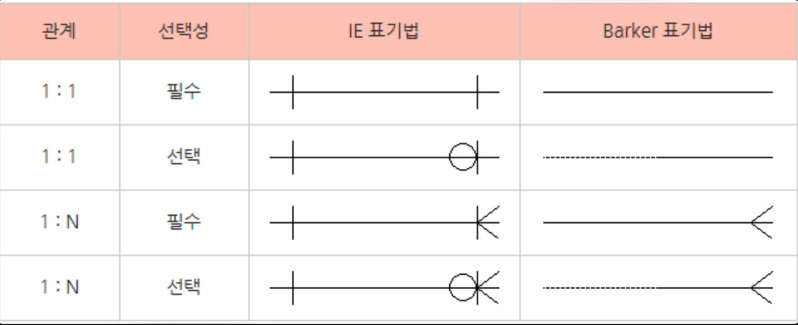
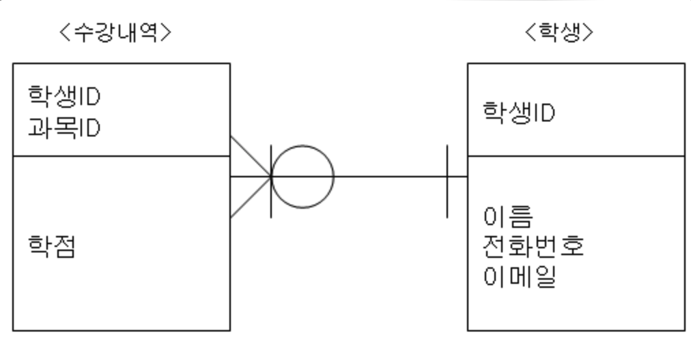

## 관계선의 종류
### 실선(Identifying) : 식별관계
- 부모테이블의 PK가 자식테이블의 FK/PK가 되는 경우
- 부모가 있어야 자식이 생기는경우

## 점선(Non-Identifying): 비식별관계
- 부모테이블의 PK가 자식테이블의 일반 속성이 되는경우
- 부모가 없어도 자식이 생기는 경우

## 기호의 종류
- ｜: 1개 / 실선은(dash) ‘1'을 나타낸다.
- ∈: 여러개 / 까마귀 발(crow’s foot or Many)은 ‘다수' 혹은 '그 이상'을 나타낸다.
- ○: 0개 / 고리(ring or Optional)은 ‘0'을 나타낸다.

## 예제
- 부모테이블 : 학생, 자식테이블 : 수강내역
- 수강내역은 하나의 학생을 갖는다.
- 학생은 0~N개의 수강내역을 갖는다.
